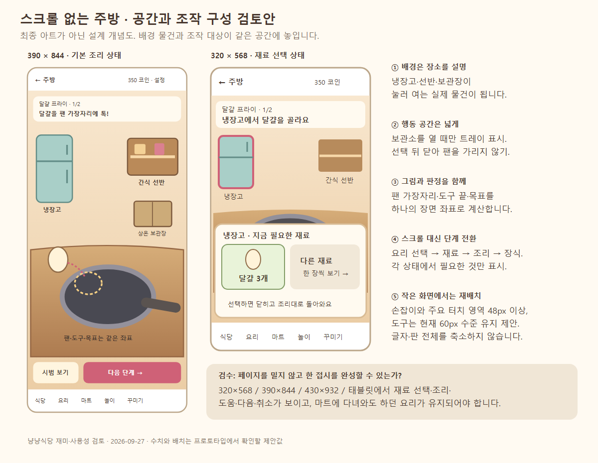

# 냥냥식당 v2 — 7~11세 플레이 경험 평가와 개선 제안

작성: 2026-09-27 · 대상: `main`의 v2 후속 개편 작업본(검토 도중 기존 개편이 `758aba7`로 커밋됨) · 성격: 코드·화면·제한된 브라우저 재현을 바탕으로 한 설계 검토

> **판정: 첫 요리와 짧은 역할놀이를 즐길 기반은 충분하다. 다만 아이가 혼자 막힘없이 플레이하고, 자기만의 결과물을 만들며, 다시 찾아올 만큼 깊이가 있는지는 보완과 실제 어린이 검증이 필요하다.** 우선순위는 레시피 양을 늘리는 것보다 **진행 막힘 해소 → 스크롤 없는 주방과 일관된 조작 → 창작물 보존 → 요리·캐릭터 반응 → 관계·목표 확장**이다.

사용자의 추가 의견인 **“요리 화면에는 스크롤이 없어야 하고, 재료 보관소와 프라이팬·냄비도 배경 속 물건처럼 보여야 한다”**, **“단조로운 BGM을 더 완성도 높은 음악으로 바꿀 수 있는가”**를 주요 개선 방향으로 포함했다. 이 문서는 평가와 제안이며 게임 구현을 변경한 기록이 아니다.

빠르게 볼 부분: **4장 주방 구성도·화면 개편안**, **9장 BGM 교체 방안**, **11장 우선순위와 완료 기준**. 실제로 재현한 진행 문제는 3장에 정리했다.

## 1. 평가 범위와 판단의 한계

- [README](../README.md), [HANDOFF](../HANDOFF.md), [후속 개편 계획](V2_FOLLOWUP_PLAN.md)을 읽고 현재 `src/v2/`의 화면·동작·경제 규칙을 검토했다. 이전 버전의 문제를 현재에도 그대로 남은 것으로 취급하지 않았다.
- 별도 임시 SQLite DB와 검토용 프로필로 현재 개발 화면을 실행했다. 기존 플레이 기록·브라우저 기록을 초기화하지 않았다. 실행 DB는 운영용 `data/nyanyang.sqlite`가 아닌 OS 임시 폴더의 `nyanyang-play-review-20260927.sqlite`였다.
- Playwright Chromium에서 첫 요리·완성·서빙, 마트 담기와 왕복, 꾸미기 화면을 확인했다. 390×844에서 마우스 입력으로 미세/큰 드래그를 비교하고 320×568·390×844·768×1024에서 주방 배치를 측정했다.
- 경제 막힘과 8접시 성장 경로는 실제 엔진 함수를 메모리에서 실행했다. UI에서 아이가 그 경로를 선택할 빈도나 걸리는 시간까지 측정한 것은 아니다.
- **실제 7~11세 어린이, 물리 iPhone/Android 터치, 장시간 플레이, 스피커 청취는 수행하지 않았다.** 재미·반복 피로·연령 차이에 관한 영향은 설계 판단 또는 검증할 가설로 구분한다. 기존 [후속 QA](V2_FOLLOWUP_QA_REPORT.md)의 자동 검사 통과를 어린이 재미의 증거로 사용하지 않는다. 이번 문서 작업에서 전체 테스트·lint·build를 다시 실행하지 않았다.
- 여자아이를 핵심 이용자로 검토하되 ‘여자아이는 분홍색·요리·꾸미기를 좋아한다’는 전제를 두지 않는다. 이야기, 조작 숙련, 수집, 표현, 역할놀이 중 무엇에 끌리는지 개인별로 확인해야 한다. 7~8세와 9~11세 구분도 모집·관찰을 위한 구간이며 능력의 경계가 아니다.

문서의 **확인**은 코드 또는 재현 사실, **판단**은 그 사실의 놀이상 의미, **제안**은 아직 구현하지 않은 변경을 뜻한다. 임의의 재미 점수를 붙이는 대신 각 요소의 강점과 위험을 분리했다.

## 2. 현재 어느 정도의 재미가 있는가

### 현재 콘텐츠의 실제 규모

| 요소 | 현재 구현 |
| --- | --- |
| 요리 | 14종: 일반 12종 + 비밀 2종, 각각 2~3단계 |
| 조리 동작 | 깨기·굽기·바르기·붓기·씻기·썰기·젓기·뒤집기·뿌리기·쌓기 10종 |
| 재료 | 18종: 유료 15종 + 무제한 양념 3종 |
| 성장 | Lv.1~5, 누적 XP 0 / 120 / 420 / 780 / 1300 |
| 관계 대상 | 일반 손님 4명 + 스페셜 별님, 엄마·아빠·동생 |
| 이야기 | 3편, 정상 손님 서빙 3·6·9회에 완료 |
| 꾸미기 | 모자 3·의상 3·액세서리 3·배경 2 = 11종 |
| 접시 표현 | 토핑 4선택(없음 포함), 모양 3선택 |
| 반복 목표 | 매일 요리 2번·손님 2명, 도감·조합 수집 |
| 별도 놀이 | 약 12.4초 재료 받기 1종, 참가비 100코인 |

근거: [content.ts](../src/v2/content.ts), [engine.ts](../src/v2/engine.ts), [AppV2.tsx](../src/v2/AppV2.tsx). 세부 보상은 [기존 밸런스 표](V2_BALANCE.md)도 참조한다.

### 관점별 판단

| 관점 | 긍정적인 점 | 지금 부족한 점 | 판단 |
| --- | --- | --- | --- |
| 첫인상 | 따뜻한 식당, 큰 눈의 동물, 친근한 한국어, 명확한 첫 주문 | 장면 속 빈 공간과 정보 밀도 차이, 이후 조리 화면의 복잡함 | 진입 매력은 좋음 |
| 성취 | 첫 접시로 Lv.2, 작은 성공에도 보상 | 성장 종료가 빠르고 이후 목표가 약함 | 초반 강점, 장기 보강 필요 |
| 직접 만드는 재미 | 도구를 잡고 움직이는 10종 동작 | 느린 이동 판정, 공용 결과 그림, 조작 대상 중복 | 가장 먼저 다듬을 핵심 재미 |
| 역할놀이·감정 | 손님과 가족에게 대접, 오주문을 가족에게 줄 수 있음 | 관계 기억·개별 의뢰·상황에 맞는 반응이 얕음 | 확장 잠재력 큼 |
| 창의성 | 장식·모양·의상·배경을 선택 | 직접 놓은 위치가 사라지고 여러 장식 배치·앨범이 없음 | 선택하는 재미는 있으나 만드는 재미가 제한됨 |
| 독립 플레이 | 시간 제한 없는 요리, 잘못된 재료 안내, 시범 | 화면 스크롤, 작업 소실, 경제 복구 부재 | 아직 충분하다고 보기 어려움 |
| 다시 하는 이유 | 비밀 요리·수집·스페셜 손님 | 같은 목표·짧은 이야기·빠른 최고 레벨 | 중장기 재미 미검증, 구조 보완 필요 |
| 포용성 | 음량 개별 설정, 모션 감소 대응, 키보드 경로 일부 | 작은 글자·작은 구매 버튼, 터치 드래그 대안·안내 부족 | 기반은 있으나 추가 검토 필요 |

**연령별 가설:** 7~8세는 도구를 움직이면 음식이 바뀌고 손님이 반응하는 짧고 명확한 흐름에서 성취를 얻을 가능성이 있다. 주문·재고·돈·재료 순서·화면 이동을 동시에 이해하는 부담부터 살펴야 한다. 9~11세는 같은 동작을 반복하는 것 외에 ‘내가 선택해서 달라진 결과’, 작품 모음, 손님 취향, 선택형 도전이 재방문 이유가 될 수 있다. 두 가설 모두 실제 참여자의 선택으로 검증해야 한다.

## 3. 추가 콘텐츠보다 먼저 해결할 문제

### 3.1 돈과 재료가 모두 없어져 플레이가 막히는 경로 — P0

**확인:** 엔진에서 다음 경로가 가능하다.

1. 처음 350코인·달걀 3개로 시작한다.
2. 달걀 프라이 3개를 각각 아빠에게 대접한다. 선호 보상은 각 150코인·하트 1개이므로 800코인·하트 3개가 되고 유료 재료가 모두 없어진다.
3. ‘요리 2번’ 보상 150코인을 받아 950코인이 된다.
4. 꽃밭 배경 400 + 노을 배경 350 + 민트 앞치마 200을 산다.
5. 결과는 **돈 0, 유료 재료 0, 완성 접시 없음, 만들 수 있는 요리 0, 미니게임 참가 불가**다. 손님 서빙 목표도 미달이고 하트 선물에는 5개가 필요하다. 날짜가 바뀌어도 요리를 시작할 재료가 생기지 않는다.

근거: `engine.ts`의 `initialGame`, `SERVE`, `CLAIM`, `BUY_COSMETIC`, `START_MINIGAME`; `content.ts`의 가격표. 재현 코드와 출력은 [경제 확인 스크립트](qa-play-review-20260927/engine-probe.mjs), [실행 결과](qa-play-review-20260927/engine-observations.json)를 참조한다.

**판단:** 가족 대접과 꾸미기는 게임이 권하는 놀이이므로, 이를 즐긴 아이가 처음부터 다시 시작해야 하는 상태는 우선적으로 막아야 한다.

**제안:** 완성 접시가 없고, 보유 재료로 만들 수 있는 요리도 없고, 현재 코인으로 부족 재료를 사서 만들 수 있는 해금 요리도 없으면 **‘곰 아저씨에게 기본 재료 받기’**를 보여 준다. 서버가 조건을 다시 확인해 달걀 1개를 지급하고 프라이 만들기로 연결한다. 받을 수 있는 재료가 생기면 버튼은 사라지며 중복 요청은 중복 지급하지 않는다. 꾸미기·XP·기록은 그대로 보존한다. 보상 없는 무료 연습도 별도로 제공할 수 있지만, 정상 경제로 복귀하는 경로를 대신하지는 못한다.

### 3.2 미세하게 움직이면 조리가 진행되지 않는 경우 — P0

**확인:** `CookingInteraction.tsx`는 굽기·씻기·바르기·뿌리기에서 개별 이동 이벤트의 가로 이동이 장면 폭의 2%를 넘어야 진행도를 더한다. 썰기·뒤집기도 세로 이동에 비슷한 문턱이 있다. 다음 이벤트는 직전 위치에서 다시 계산한다.

390×844 브라우저의 굽기 동작에서 목표 진입 후 진행도가 **23.779%**였다. 목표 안에서 약 1px 간격으로 총 약 560px를 왕복했는데 **23.779% 그대로**였고, 같은 영역에서 35~70px 간격의 큰 이동을 주자 **100%**가 됐다. 이는 작은 이동 간격 입력의 브라우저 재현이다. 이벤트 시간 간격과 실제 손가락 속도를 측정한 것은 아니며, 물리 기기에서 발생할 빈도도 아직 모른다. [재현 수치](qa-play-review-20260927/runtime-observations.json), [해당 화면](qa-play-review-20260927/04-fine-drag-no-progress.png).

**판단:** ‘천천히 해도 괜찮아요’라는 안내와 반대되는 체감을 줄 수 있다. 기존 자동 검사의 큰 이동 입력만으로는 잡기 어려운 문제다.

**제안:** 유효 영역 안의 작은 이동을 누적하고, 충분한 왕복·절단·회전이 됐을 때 진행시킨다. 잡음 제거와 유효 동작 판정을 분리한다. 같은 경로를 20·60·120개 이벤트로 나눠도 결과가 유사해야 한다. 손가락이 목표 경계를 잠깐 벗어나도 즉시 모든 노력을 잃지 않게 한다.

### 3.3 하던 일과 직접 만든 결과가 이어지지 않음 — P1

- **장소 이동:** 주방과 마트의 진행 상태가 화면 내부 상태라 탭 이동으로 사라진다. 브라우저에서 장바구니 `1개·55코인 → 식당 → 마트 → 0개·0코인`, 달걀 깨기 `100% → 마트 → 요리 → 레시피 선택 화면`을 확인했다. 재료 중복 차감이 없는 것은 장점이지만 아이가 한 일은 없어지는 문제다.
- **접시 배치:** `platePoint`로 놓은 위치는 `COOK` 요청과 `HeldDish`에 포함되지 않는다. 토핑·모양 선택은 남지만 최종 그림은 정해진 위치에 그린다. ‘직접 놓기’를 요구하는데 배치 결과는 서빙까지 보존되지 않는다.

**제안:** 진행 중 요리와 장바구니를 프로필별로 유지하고 마트 복귀 시 ‘하던 요리 계속하기’를 보여 준다. 접시 좌표를 저장·서빙·앨범에 공통 적용한다. 추후 저장 구조를 변경할 때 기존 데이터에 기본값을 제공하고 이전 기록을 초기화하지 않는다.

## 4. 스크롤 없는 주방과 배경 속 물건 — 핵심 화면 개편안

### 4.1 현재 불편의 원인

현재 주방은 `안내 → 위쪽 변화 그림 → 조리판 → 진행 막대·도움 → 보관소 버튼 → 재료 목록 → 힌트 → 다음 버튼`을 세로로 쌓는다. 재료를 고르려고 내려갔다가 다시 팬으로 올라오는 흐름이 생긴다. **스크롤을 끄는 CSS만 추가하면 필요한 조작이 잘린다. 정보와 행동의 배치를 바꾸어야 한다.**

프라이 첫 단계에서 냉장고를 열고 재료 투입 전 상태를 측정한 값이다. 본문은 `.v2-main` 내부 영역이며 전체 문서 가로 넘침 검사와 다른 문제다.

| 브라우저 뷰포트 | 본문 표시 높이 | 본문 콘텐츠 높이 | 차이 | 관찰 |
| --- | ---: | ---: | ---: | --- |
| 320×568 | 412px | 964px | 552px | 보관소가 화면 아래에 있고 재료·조리판을 동시에 보기 어려움 |
| 390×844 | 688px | 946px | 258px | 냉장고 내부와 아래 안내를 보려면 본문 이동이 필요 |
| 768×1024 | 868px | 946px | 78px | 현재 최대 폭 제한 안에서도 세로 스크롤이 남음 |

근거: [배치 측정값](qa-play-review-20260927/layout-observations.json), [320 화면](qa-play-review-20260927/kitchen-320.png), [390 화면](qa-play-review-20260927/kitchen-390.png), [태블릿 크기 화면](qa-play-review-20260927/kitchen-768.png). 기기 안전 영역·브라우저 UI에 따라 실제 사용 높이는 달라진다.

### 4.2 권장 구조: 한 화면의 주방 무대

[확대 가능한 SVG 구성도](qa-play-review-20260927/no-scroll-kitchen-concept.svg). **이 그림은 제안하는 공간·상태 구성도이며 최종 아트나 구현 완료 화면이 아니다.**

| 영역 | 제안하는 모습과 행동 |
| --- | --- |
| 상단 | 작은 주문 그림 + 현재 단계 + 한 문장 안내. 조리 중에는 큰 로고·XP 상세를 접어 공간 확보. 설정과 나가기는 찾을 수 있게 유지 |
| 뒤쪽 벽 | 왼쪽 냉장고, 오른쪽 간식 선반과 상온장. 별도 메뉴 카드 대신 배경 속 물건을 눌러 연다. 짧은 이름표·손잡이·선택 테두리로 조작 가능성을 알림 |
| 앞쪽 작업대 | 현재 동작에 필요한 팬·냄비·도마·그릇 중 하나가 중심. 같은 장소에서 음식이 변화하고, 손으로 잡는 도구가 그 옆에 놓임 |
| 아래 고정 행동 | ‘시범 보기’와 ‘다음 단계/접시 꾸미기/완성’을 일관된 위치에 표시. 긴 안내를 아래에 추가해 페이지를 늘리지 않음 |
| 재료 트레이 | 보관소를 열었을 때만 잠시 표시. 재료를 고르면 작업대에 들어가는 반응 후 닫거나 필요한 다음 재료로 이어짐 |
| 접시 상태 | 작업대의 팬이 접시로 바뀌고 장식 트레이가 나타남. 다른 세로 페이지로 보내지 않고 같은 공간에서 완성 |

‘버튼처럼 보이지 않게’는 조작 의미를 없애자는 뜻이 아니다. 냉장고 문·선반은 실제 구현에서 이름이 있는 버튼 또는 동등한 접근 가능한 요소여야 하며, 터치 판정은 그림의 손잡이보다 넓게 둘 수 있다. 움직이는 모션을 꺼도 선택한 보관소와 열림 상태가 보여야 한다.

### 4.3 한 화면을 유지하는 상태 전환

1. **요리 선택:** 현재 주문을 우선 표시하고 나머지는 한 화면 2×2 카드와 이전/다음으로 제시한다. 요리 탭 전체의 세로 스크롤을 없애려면 레시피 선택도 함께 바꾼다. 이미 가능한 요리·재료 부족·잠금은 그림과 짧은 말로 구분한다.
2. **재료 준비:** ‘냉장고에서 달걀을 골라요’처럼 한 행동을 안내한다. 해당 보관소를 열면 이번 단계 재료 1~3개를 우선 보여 준다. 탐색을 원하는 아이는 ‘다른 재료’를 볼 수 있다. 전체 목록은 한 번에 4~6개와 페이지 버튼으로 제공하며 세로 스크롤을 만들지 않는다.
3. **직접 조리:** 재료 선택이 끝나면 트레이가 닫히고 작업대가 넓어진다. 활성 도구와 목표 하나에 집중한다. 재료 트레이가 열려 있는 동안에는 팬의 도구 입력을 잠시 비활성화해 겹침을 막는다.
4. **접시 꾸미기:** 같은 작업대에서 장식 선택→놓기→옮기기/되돌리기→완성을 제공한다. 장식 트레이는 접시의 주요 영역과 겹치지 않는다. 작은 화면에서는 선택 모드와 배치 모드를 번갈아 보여 준다.
5. **마트 왕복:** 부족 재료를 그림 목록에 담아 마트로 가져가고 구매 후 같은 요리·같은 단계로 돌아온다. ‘화면을 벗어나면 취소’가 기본 동작이 되어서는 안 된다.

### 4.4 화면 크기별 절충

| 크기 | 배치 원칙 |
| --- | --- |
| 320×568 | 배경 장식과 보조 HUD를 줄이고 현재 행동 하나를 크게 보여 준다. 보관소 전체 내부를 항상 펼쳐 놓지 않는다. 좁은 화면 전용 위치 배치로 전환하며 도구를 축소해서 맞추지 않는다. |
| 390×844·430×932 | 뒤쪽 보관소와 앞쪽 작업대가 한 공간으로 보이게 한다. 아래 고정 버튼과 두 줄 이내 안내를 유지한다. 여유 공간은 캐릭터 반응·음식 변화에 사용한다. |
| 태블릿 세로·가로 | 세로는 같은 구도를 넓히고 가로는 보관소와 작업대를 좌우로 재배치한다. 필요한 물건을 중앙 가까이에 두어 화면 끝까지 드래그하게 하지 않는다. 기존 최대 폭 600px 제한도 함께 검토한다. |

**프로젝트 설계 목표값:** 주요 터치 영역 48×48 CSS px 이상, 조리 도구는 현재 60×60px 수준 유지, 핵심 안내 14~16px부터 시도한다. 학술적으로 확정된 연령별 최적값이나 W3C 의무 수치가 아니다. `100dvh`와 안전 영역을 기준으로 남는 공간을 계산하고, 글자 확대·가로 회전·주소창 변화에서도 실제 표시 높이를 확인한다. 큰 글자 모드에서는 추가 상태 분할을 허용해 가독성을 보존한다.

### 4.5 팬·냄비까지 배경과 자연스럽게 연결하는 방법

- 배경 한 장에 모든 팬·냄비를 구워 넣고 그 위에 다른 조리판을 얹으면 대상이 중복된다. **배경은 벽·바닥·작업대**, **조작 오브젝트는 냉장고 문·팬·냄비·도구**, **음식은 상태가 변하는 별도 층**으로 구성한다.
- 같은 시점·광원·그림자·윤곽선으로 그려 팬이 작업대 위에 놓이고 손잡이가 잡을 수 있는 방향을 향하게 한다. 팬 아래 접지 그림자, 그릇 앞 테두리, 음식의 앞뒤 가림을 통일한다.
- ‘작업대 전체 배경’과 ‘조작 판정’을 같은 장면 좌표로 정의한다. 현재는 가운데 최대 330px의 SVG와 조작 영역 전체의 % 좌표가 섞여 있다. SVG 장면이면 화면 좌표를 장면 좌표로 변환하고, 팬 가장자리·도구 끝·목표 영역이 같은 위치 데이터를 사용하게 한다.
- 화면 크기가 바뀌면 장면 배치 규칙을 바꾸되 음식과 판정을 따로 늘리지 않는다. 장식 배경은 잘라도 되지만 냉장고 손잡이·팬·다음 버튼은 잘리지 않아야 한다.
- 처음에는 프라이 하나로 `냉장고 열기→달걀→깨기→익기→접시` 전체를 시제품으로 확인한다. 이 구조가 검증된 뒤 나머지 동작에 확장한다.

**완료 기준:** 320×568·390×844·430×932·태블릿 세로/가로에서 요리 선택부터 완성까지 본문과 주방 내부의 스크롤 없이 진행할 수 있고, 다음 행동이 잘리지 않으며, 그림·터치 판정이 일치하고, 마트 왕복·화면 회전 뒤 진행이 유지되어야 한다.

## 5. 디자인: 귀여움에서 ‘만지고 싶은 공간’으로

**유지할 것:** 식당의 따뜻한 채광과 크림·갈색·분홍 포인트, 고양이 셰프와 손님의 또렷한 표정, 외형이 달라진 가족, 의상 미리보기. 현재 화면을 전부 새 스타일로 바꿀 이유는 없다.

**현재 화면에서 보이는 보완점:**

- 캐릭터·배경은 풍부한 채색이고 마트 재료·팬·가구는 단순한 도형과 굵은 윤곽이 많다. SVG라는 기술 자체가 문제라기보다 **광원·질감·윤곽·시점의 차이**가 같은 장면에서 느껴진다. 음식·작업대부터 공통 아트 기준으로 맞추는 편이 효과적이다.
- 마트의 상품·가격·보관 수량은 일부 9~10px이고 담기 버튼 높이는 약 25px로 정의돼 있다. 제품 그림 전체를 선택 영역으로 삼고 가격을 간결하게 표시하면 작은 버튼만 겨냥하는 부담을 줄일 수 있다.
- 식당의 넓은 바닥과 마트 선반 아래 빈 공간은 편안한 분위기를 주지만 핵심 상호작용을 밀어내기도 한다. 캐릭터와 작업대를 가까이 두고, 쓸 공간과 분위기용 공간을 구분한다.
- 도감·퀘스트·설정은 그림 아이콘만 보인다. 첫 방문 시 짧은 이름을 함께 표시하고, 요리 중에는 주문·다음 행동의 시각 우선순위를 가장 높인다.
- 잠금과 재고 부족을 색뿐 아니라 문구로 설명하는 현재 방향은 유지한다. 설명이 필요한 상태를 연한 색으로만 처리하지 않는다.

아트 검수는 개별 파일의 예쁨보다 **390px로 축소했을 때 같은 주방의 물건처럼 보이는가, 누를 대상을 알아볼 수 있는가**를 기준으로 한다. 현재 [아트 조사](V2_FOLLOWUP_ART_AUDIT.md)와 연결해 음식·도구·가구의 시점과 명암 기준을 먼저 정리하는 것이 좋다.

## 6. 조작감과 요리별 변화

### 손 시범과 실제 움직임을 맞춘다

현재 시범은 시작점에서 목표로 가는 직선을 반복한다. 목표에 도착한 뒤의 원 젓기·위아래 썰기·위로 뒤집기까지 가르쳐 주지 않는다. 시범을 **잡기→목표까지→유효 동작 1회→음식 변화**로 동작마다 다르게 만든다. 처음 접하는 동작에서 한 번 보여 주고 다시 볼 수 있게 한다.

드래그를 어려워하는 이용자에게는 ‘재료 탭→목표 탭’, ‘도구 선택→넓은 조리 버튼으로 한 동작’ 같은 **단일 포인터의 비드래그 대안**도 제공한다. 현재의 키보드 화살표/Enter 경로만으로 터치 대체가 충족되는 것은 아니다. 도움 사용을 보상 감점으로 연결할 이유는 없다. [W3C 드래그 대안 설명](https://www.w3.org/WAI/WCAG22/Understanding/dragging-movements.html).

### 내가 한 행동 때문에 음식이 바뀌어야 한다

현재 `CookScene.tsx`에는 동작별 공용 그림이 많다. 바나나를 썰어도 붉은 타원 조각, 코코아를 저어도 황갈색 반죽, 라면의 붓기 단계에도 우유 용기 형태가 사용된다. 위쪽 글로 ‘초코색이 됐다’고 말하는 것보다 작업대의 음식이 직접 바뀌어야 이해와 만족이 생긴다.

| 우선 요리 | 보여 줄 핵심 변화 | 조작·소리 연결 |
| --- | --- | --- |
| 달걀 프라이 | 껍질 분리→흰자가 팬에 퍼짐→불투명해짐 | 팬 가장자리 접촉 때 톡, 익는 동안 약한 치익 |
| 잼 토스트 | 빵의 구움 자국→손이 지나간 자리에 잼이 퍼짐 | 뒤집는 순간 착, 펴 바를 때 부드러운 마찰 |
| 코코아 | 우유와 가루의 줄무늬→회전에 따라 초코색으로 섞임 | 그릇 안에서 젓는 느낌과 작은 도구 소리 |
| 바나나 | 바나나 단면이 하나씩 생김 | 칼날 접촉 시 잘림, 손잡이와 칼날의 위치 일치 |
| 치즈·라면 | 치즈가 늘어남 / 국물과 면·김의 변화 | 레시피별 대표 변화 하나를 먼저 완성 |

조리 시간이나 손동작 횟수를 무조건 늘리지 않는다. **새 변화 없이 동일한 손동작만 늘어나면 노동감이 커질 수 있다.** 반복 레시피는 기본 동작은 유지하되 장식·의뢰·재료 선택이 달라지게 하고, 숙련 도전은 선택 사항으로 둔다.

## 7. 캐릭터 모션과 대접의 보람

현재도 손님 등장, 기본→기쁨 이미지 전환, 엄마의 회전·아빠의 확대·동생의 점프가 있다. ‘모션이 없다’고 평가하는 것은 부정확하다. 다만 많은 동작이 **그림 전체 이동·확대·회전과 접시 축소/소멸**이어서 음식과 몸의 연결이 약하다.

### 권장 연기 순서

`완성 음식 쳐다보기 → 앞발/손으로 받기 → 음식 가까이 몸 기울이기 → 한 입 → 작은 씹기 → 표정과 대사 → 보상`

| 대상 | 추가하면 좋은 작은 연기 | 놀이에서의 의미 |
| --- | --- | --- |
| 셰프 | 도구를 볼 때 시선 이동, 집중하는 귀, 완성 후 접시를 들어 보이기 | ‘내가 조리하는 캐릭터’라는 연결 |
| 일반 손님 | 등장 인사, 음식 쪽 시선, 한 입·만족 표정 | 기다리는 그림에서 반응하는 상대가 됨 |
| 가족 | 서로 다른 귀·꼬리·앞발 반응과 선호 음식 대사 | 같은 요리를 누구에게 줄지 선택할 이유 |
| 곰 마트 주인 | 상품을 바라봄, 계산 후 봉투를 건네는 짧은 동작 | 돈 차감과 재료 획득의 원인·결과를 설명 |
| 별님 | 등장에 작은 반짝임, 새 음식에 놀라는 표정 | 특별한 만남을 시각적으로 구별 |

초기 제작 범위는 셰프와 대표 손님 한 명의 `기대/받기/먹기/만족`부터 잡는다. 전체 애니메이션을 길게 만들기보다 얼굴·앞발 같은 일부 레이어나 소수 프레임으로 핵심 행동을 표현한다. 접시 전체가 사라지는 대신 음식에서 한 입 분량이 줄어드는 변화가 있으면 대접의 의미가 더 명확하다.

**제안 타이밍:** 입력 후 잡힘·눌림 반응 0.1~0.2초, 한 입과 표정 1.5~2.5초를 시제품 출발값으로 삼는다. 측정된 최적값이 아니므로 아이 반응과 기기 성능으로 조정한다. 반복 연출은 건너뛸 수 있게 하되 결과 텍스트와 새 이야기는 자동으로 사라지지 않게 한다.

현재 식사 결과는 3.9초 후 닫힌다. 읽는 속도에 맞추어 **짧은 모션 뒤 결과를 정지시키고 ‘계속’ 버튼으로 닫는 방식**을 권한다. 카드 전체를 누르면 즉시 닫히는 동작은 의도치 않은 닫힘을 유발할 수 있다. 모션 감소에서는 정적인 표정·한 입 변화·문구만으로 동일 정보를 전달한다. [W3C 상호작용 애니메이션 설명](https://www.w3.org/WAI/WCAG22/Understanding/animation-from-interactions.html).

## 8. 창작·이야기·성장·경제를 더 오래 즐기게 하는 방법

### 8.1 접시를 선택하는 것에서 작품을 만드는 것으로

1. **먼저 배치 보존:** 현재 직접 놓은 좌표가 완성·서빙에 남게 한다.
2. **작은 표현 범위:** 장식 최대 3개, 이동·삭제·되돌리기, 접시 색 3개부터 시작한다. 세밀한 편집 도구를 처음부터 늘리지 않는다.
3. **내 요리 앨범:** 이름이나 스티커를 붙이고 다시 보고 다시 만들 수 있게 한다. 현재 조합 도감은 `레시피:토핑:모양`의 기록 수를 보여 주는 수준이다.
4. **놀이 결과 연결:** 손님이 ‘별 장식이 예쁘네’처럼 실제 선택을 알아봐 준다. 단순 보상 숫자보다 ‘내가 다르게 만든 것’을 인식하는 반응을 제공한다.

비밀 요리는 현재 해금 레벨에서 카드를 고른 후 정해진 재료 순서대로 만드는 구조다. 자유 재료 실험으로 발견하는 시스템은 아니다. 이를 발전시키려면 먼저 2~3가지 안전한 분기만 만든다. 예를 들어 마지막 장식 선택으로 비밀 결과가 바뀌고, 틀린 선택은 새로운 평범한 요리로 남게 한다. 모든 재료 조합을 처리하는 거대한 제작 시스템은 후순위다.

### 8.2 가족에게 대접하는 것도 의미 있는 진행으로

현재 이야기 3편은 정상 손님 서빙 횟수로 열린다. 가족에게 대접하는 행동은 이 이야기와 손님 목표를 진전시키지 않고 콤보도 초기화한다. 이야기의 비가 그침·생일 축하·밤 축제는 주로 텍스트로 표현되며 실제 장면 변화와 충분히 연결되어 있지 않다.

**제안:** 기존 이야기마다 `선택 1개 + 요리/장식 조건 1개 + 눈에 보이는 변화 1개`를 붙인다. 다음은 신규 의뢰 예시다.

- 비 오는 날: 따뜻한 요리 중 하나를 고르면 창가에 머그가 놓이고 손님이 우산을 말린다.
- 생일: 친구를 위한 접시 장식 하나를 고르면 식당에 풍선이 남는다.
- 가족 저녁: 엄마·아빠·동생 중 누구에게 먼저 대접할지 고르면 감사 대사와 앨범 그림이 남는다.

가족 친밀도는 먹이지 않으면 줄어드는 의무가 아니라, 대접하면서 기억과 선택지가 늘어나는 방향이 적합하다. 선호가 아닌 음식에 실망·죄책감·관계 하락을 주는 방식은 현재의 편안한 분위기와 맞지 않는다.

### 8.3 최고 레벨 이후에도 하고 싶은 일

**확인:** 일반 요리만으로 `프라이 1 → 바나나 토스트 2 → 치즈 토스트 2 → 팬케이크 3`의 8접시 경로가 가능하다. 필요한 재료를 실제 엔진 명령으로 사고 가족에게 대접했을 때 누적 XP는 `120, 270, 420, 600, 780, 1000, 1220, 1440`, 최종 Lv.5였다. 이는 가능한 경로이며 평균 어린이 플레이 시간은 아니다. 손님 이야기는 9회 서빙으로 3편 모두 완료된다.

첫 요리의 빠른 성장은 유지하고 이후에 **내가 고르는 목표**를 추가한다. ‘새 음식 3개 만들기’, ‘단골의 취향 알아보기’, ‘식당 주제 완성하기’ 중 2~3개를 제시하고 바꿔도 손해가 없게 한다. 이야기 스티커를 실제로 배치하는 식당 장식으로 연결하면 기존 보상도 살아난다.

레벨 상한과 필요 XP만 크게 늘리면 반복해야 하는 양만 증가한다. 새로운 손동작·선택·관계 결과 없이 음식 이름만 추가하는 것보다 기존 3종의 조리 반응과 창작 결과를 깊게 만드는 편을 우선한다.

### 8.4 경제·장보기의 이해 가능성

- 토마토 달걀 컵은 씻기와 썰기 단계의 토마토를 각각 소비하고, 딸기 스무디도 딸기를 두 번 요구한다. 단계별 재료 배열을 합산하는 현재 규칙 때문이다. 같은 재료를 이어 손질하는 의도라면 **소모 수량과 공정 재료를 분리**하고, 두 개 사용이 의도라면 시작 전에 총수량을 그림으로 알린다.
- 꾸밈 토핑은 재료를 하나 더 쓰지만 가족 보상은 기본 요리 재료비를 기준으로 한다. 비선호 가족에게 딸기 토핑을 더하면 기본 이익 45에서 딸기 65가 빠져 실질 −20코인이 될 수 있다. 창작 비용을 없애거나 실제 비용까지 보전할지 명확하게 정하고 숨은 손해를 줄인다.
- 마트에 ‘현재 주문에 필요한 것’ 그림 메모와 부족 수량을 가져간다. 선택·합계·보유 코인·계산 완료를 보여 주되 재료 준비를 읽기와 산수의 시험처럼 만들지 않는다.
- 100코인 미니게임 완료 보상은 최소 135코인어치 **재료**이며 현금이 아니다. 중도 포기는 보상이 없다. 무료 연습·중단 안내를 제공하고 필요한 재료 꾸러미를 선택하게 하는 방안을 검토한다.
- 낙하물은 달걀·빵·우유·잼·바나나지만 실제 보상은 점수별 고정 꾸러미다. 잡은 재료와 받는 재료가 같지 않다. 보상을 사전에 그림으로 보여 주거나 실제 획득과 지급 규칙을 맞추어 기대 차이를 줄인다.

## 9. BGM을 더 완성도 높은 음악으로 바꾸기

**교체할 수 있다. 권장안은 편곡된 오디오 파일을 사용하고, 곡의 반복 구조와 화면 전환 처리도 함께 바꾸는 것이다.** ‘고급진 음악’을 큰 오케스트라나 많은 악기로 해석하기보다, 자연스러운 악기 음색·화성 변화·멜로디의 쉼·매끄러운 반복·적절한 음량으로 구체화하는 편이 이 게임에 맞다.

### 9.1 현재 단조로움의 구조적 원인

사용자는 현재 음악이 단조롭다고 느꼈다. 아래는 그 피드백과 부합하는 **코드상 원인 후보**이며 검토자가 실제 스피커로 청취해 평가한 결과는 아니다.

| 현재 구현 | 음악 경험에 미칠 수 있는 영향 |
| --- | --- |
| 식당·마트 곡이 각각 음표/쉼표 32슬롯, 슬롯 간격 0.36초/0.29초 | 식당 약 **11.52초**, 마트 약 **9.28초**마다 같은 음형이 돌아옴 |
| 식당 멜로디는 sine, 마트는 triangle 발진기. 같은 짧은 감쇠 방식 | 어쿠스틱 악기 특유의 강약·질감·잔향이 제한됨 |
| 두 곡 모두 4슬롯마다 C3 저음 반복 | 베이스와 화성의 변화가 적어 긴 흐름을 느끼기 어려움 |
| 마트 외 식당·주방·놀이·꾸미기는 모두 식당 테마 | 집중 조리와 활기 있는 놀이의 분위기 차이가 작음 |
| `AppV2.tsx`의 view 변경 시 effect 정리에서 `stopMusic()` 실행 | 같은 테마를 쓰는 탭끼리 이동해도 처음부터 시작해 도입부를 자주 듣게 됨 |

슬롯 길이만으로 BPM을 단정하지 않는다. 슬롯을 4분음표로 볼지 8분음표로 볼지에 따라 해석이 달라진다. 근거: [audio.ts](../src/v2/audio.ts)의 `tunes`, `startMusic`, `pluck`; [AppV2.tsx](../src/v2/AppV2.tsx)의 음악 effect.

### 9.2 변경 방식 비교

| 방식 | 장점 | 제작·운영 부담 | 권고 |
| --- | --- | --- | --- |
| **편곡된 라이선스 음원 파일** | 실제 악기 또는 좋은 가상악기의 음색을 빠르게 시험 가능 | 장면과 어울리는 곡 선정, 루프 편집, 게임 배포·출처 조건 확인 필요 | **첫 비교 시제품에 적합**. 1~2곡으로 현재 음악과 비교 |
| **게임 전용 작곡·편곡** | 식당·마트·성공 소리에 공통 테마를 쓰고 필요한 분위기로 변주 가능 | 작곡/편곡/믹싱 작업과 권리 범위 합의 필요. 비용·일정은 별도 견적 | 장기적으로 가장 일관된 방향. 먼저 메인곡과 마트 변주부터 |
| **현재 Web Audio 합성곡 확장** | 작은 용량, 상태에 따라 음형·악기를 바꾸기 쉬움 | 화성·베이스·리듬·음색을 모두 설계해야 하며 코드 양만 늘려도 음악 품질이 보장되지 않음 | 임시 개선 또는 보조 효과에 적합. 현재 멜로디만 늘리는 것은 제한적 |

여기서 파일 기반은 재생 기술을 포기하는 뜻이 아니다. **작곡·편곡된 음원을 Web Audio로 재생·혼합**할 수 있다. 외부 음악 생성 도구를 택하는 경우에도 후보 음원의 실제 품질, 루프 연결, 곡·녹음의 사용 조건을 확인해야 하며 자동 생성만으로 품질을 보장하지 않는다. 이번 검토에서는 음원을 생성·구매·다운로드하거나 실제 게임에 교체하지 않았다.

### 9.3 냥냥식당에 맞는 음악 방향

아래 길이·템포는 시제품 제작을 위한 제안값이다. 어린이에게 입증된 최적값은 아니다.

| 장면 | 악기·편곡 방향 | 길이·변화 제안 |
| --- | --- | --- |
| 식당·메뉴 | 부드러운 피아노, 가벼운 어쿠스틱 기타나 피치카토, 둥근 베이스, 작은 브러시 리듬. 기억하기 쉬운 짧은 주제 | 90~120초의 자연스러운 반복. 약 75~95 BPM에서 A→짧은 응답→B→주제로 돌아오기. 멜로디가 쉬는 구간 포함 |
| 주방 | 메인 테마의 반주 중심 변주. 조리음을 가리지 않게 리드와 고음을 줄임 | 처음에는 새 곡 대신 메인 반주 버전 사용. 같은 테마 안에서 볼륨/레이어만 바꾸어 첫 음부터 재시작하지 않음 |
| 마트 | 같은 주제를 조금 경쾌한 리듬과 기타·가벼운 타악기로 변주 | 60~90초, 약 95~110 BPM부터 시험. 지나친 고음 반복·빠른 벨 소리 제한 |
| 꾸미기·앨범 | 메인 테마의 조용한 악기 구성, 충분한 쉼 | 처음에는 주방과 반주 버전 공유. 여러 곡을 만드는 비용보다 한 곡의 품질을 먼저 확인 |
| 재료 받기 | 기본 테마에 가벼운 리듬을 더해 놀이 시작을 알림 | 약 12초 놀이에 맞춘 짧은 변주 또는 리듬 층. 마지막 5초를 위협적인 가속 음악으로 만들 필요 없음 |
| 완성·스페셜 손님 | 메인 멜로디의 일부를 사용하는 짧은 성공 음형 | 1~2초 정도부터 시험하고 재생 중 BGM을 잠시 낮춤. 효과음과 겹쳐 과하게 커지지 않게 함 |

아기 장난감 같은 날카로운 소리나 쉼 없이 떠드는 멜로디를 피한다는 방향은 **이번 제품의 편안한 식당 분위기를 위한 제안**이며 특정 성별의 음악 취향을 가정한 것이 아니다. 목소리 없는 음악부터 비교하면 안내 글 읽기와 조리음의 자리를 확보하기 쉽다.

### 9.4 실제 도입 방법과 범위

1. **1차 범위는 메인 1곡 + 마트 1곡 + 짧은 완성음으로 제한**한다. 가능하면 메인곡의 반주 버전도 받는다. 서로 무관한 스타일의 곡을 많이 모으기보다 같은 세계의 음악처럼 들리게 한다.
2. 원본은 편집 가능한 고품질 파일로 보관하고 게임에는 브라우저별 재생을 확인한 압축 파일을 사용한다. 짧은 루프는 전체 파일을 디코딩해 반복 시작·끝을 지정하고, 인코딩 지연·끝 잔향까지 실제로 들으며 이음새를 확인한다. 길이가 긴 음원은 메모리 사용량을 고려해 스트리밍도 검토한다. [MDN 디코딩](https://developer.mozilla.org/en-US/docs/Web/API/BaseAudioContext/decodeAudioData), [루프 재생](https://developer.mozilla.org/en-US/docs/Web/API/AudioBufferSourceNode/loop).
3. 음악 제어는 화면 컴포넌트의 생성/소멸과 분리한다. **음악 테마가 같으면 계속 재생**, 달라지면 약 1~2초의 교차 페이드부터 시험한다. 두 소스를 각 GainNode에 연결해 음량을 바꾸는 구현이 가능하다. 같은 곡의 중복 재생과 갑작스러운 음량 증가를 막는다. [MDN 음량 변화 API](https://developer.mozilla.org/en-US/docs/Web/API/AudioParam/linearRampToValueAtTime).
4. 새 셰프 시작이나 첫 명시적 조작에서 오디오를 활성화한다. 자동재생 차단·전화/다른 앱 전환·브라우저 복귀를 다루고, 숨은 탭에서는 재생 자원을 줄인다. 음원 로딩 실패가 게임 입력을 막지 않게 한다. [MDN Web Audio 권장사항](https://developer.mozilla.org/en-US/docs/Web/API/Web_Audio_API/Best_practices).
5. 현재 BGM/효과음 개별 음량·음소거 저장은 유지한다. 알림·조리 소리는 음악보다 알아듣기 쉽게 하되 절대 음량 수치를 ‘모든 기기에서 안전한 값’으로 단정하지 않는다. 휴대전화 스피커와 헤드폰에서 실제로 확인한다.

**라이선스 확인:** ‘무료’, ‘로열티 프리’, ‘클래식’이라는 표기만으로 게임에 넣을 권한을 판단하지 않는다. 사용할 **곡과 녹음 파일 각각**에 대해 게임 포함 배포, 상업 이용 가능성, 자르기·루프·페이드 편집, 출처 표시를 확인한다. 공개 Git에 파일을 넣는 경우 원본 재배포 조건도 별도로 확인한다. 예를 들어 [Incompetech 공식 FAQ](https://incompetech.com/music/royalty-free/faq.html)는 게임 크레딧과 편집을 설명하고, [CC BY 4.0 본문](https://creativecommons.org/licenses/by/4.0/legalcode.en)은 표시 조건하의 배포·변형 권한을 명시한다. 이 조건을 다른 스톡 음원에 일반화하지 않는다. 선정 시 파일명·곡명·작곡/녹음 권리자·원본 링크·라이선스 버전·취득일·편집 내용을 `docs/AUDIO_ASSETS.md` 같은 자산 표에 기록한다. 현재 이 자산 표는 새 음원을 선정한 뒤 만들 후속 산출물이다.

### 9.5 음악 교체 완료 기준

- 같은 체감 음량으로 기존/후보 음악을 비교해 사용자가 말한 단조로움이 줄었는지 확인한다. 음량이 큰 후보가 자동으로 더 좋게 느껴지는 비교를 피한다.
- 각 후보를 5~10분 연속 듣고 도입부 반복·고음 피로·강한 박자의 재촉감·조리음 가림을 기록한다. 어린이에게는 선택과 이유를 묻고 청취를 강요하지 않는다.
- 식당→주방→꾸미기에서 곡이 처음으로 돌아가지 않고, 식당↔마트 전환에서 끊김·중복·음량 튐이 없다.
- 반복 시작점에서 클릭음·침묵·잔향 절단이 없고, 음소거·음량 변경·모바일 복귀가 작동한다.
- 음원 파일 실패에도 게임은 계속되며, 적용할 모든 곡의 권리·출처 기록이 준비된다.

**우선순위:** BGM은 부가 꾸밈으로 마지막에 미루기보다, 주방 개편의 첫 시제품과 나란히 **작은 범위의 비교 교체**를 진행하는 편이 좋다. 모든 장면의 전용곡과 복잡한 상황별 편곡은 메인곡의 반응을 확인한 뒤 확장한다.

## 10. 효과음·접근성·플레이 리듬

현재 BGM/효과음 개별 음량과 음소거, 모션 감소 대응, 미니게임 종료 5초 안내는 유지할 강점이다. 효과음은 물·달걀 깨짐·지글거림·칼·접시 놓기처럼 행위와 재질을 구별하는 방향을 권한다. 매 포인터 이벤트보다 한 번의 유효 스트로크·음식 변화 시점에 재생하고, 연속 조작에 날카로운 소리가 과하게 겹치지 않게 한다. 필수 정보는 소리 없이도 알 수 있어야 한다.

주요 타깃을 크게 만들고 작은 보조 글자를 핵심 설명으로 사용하지 않는다. W3C의 AA 타깃 기준은 원칙적으로 24×24 CSS px이며 간격 등의 예외가 있다. 이 문서의 48px은 어린이 조작을 고려한 **제품 설계 제안**이다. 현재 버튼 몇 개의 크기만으로 접근성 준수/실패 전체를 판정하지 않는다. [W3C 타깃 크기 설명](https://www.w3.org/WAI/WCAG22/Understanding/target-size-minimum.html).

모달 포커스·키보드 안내·진행 막대 의미·그림의 한글 대체 이름도 함께 점검한다. CSS 모션 감소가 있어도 재료 받기의 JS 낙하 이동은 계속되므로 ‘모든 움직임이 정지한다’고 설명하지 않는다. 별도 쉬운 속도·연습 모드를 제공하는 편이 낫다.

장기 재미를 출석 강요·연속 접속 손실·놓치면 사라지는 보상으로 만들 필요는 없다. ‘오늘 만든 접시’와 저장 상태를 보여 주고 자연스럽게 마칠 수 있게 한다. 오랜 시간 붙잡는 것보다 다시 해보고 싶은 활동을 남기는 것을 목표로 삼는다.

## 11. 권장 작업 순서와 완료 기준

P0는 독립 진행을 막거나 핵심 입력을 불안정하게 하는 문제, P1은 핵심 놀이 경험, P2는 그 이후 확장이다. 작업 규모는 상대적인 범위이며 일정 견적이 아니다.

| 순서 | 작업 | 규모 | 완료 기준 |
| --- | --- | --- | --- |
| P0-1 | 경제 구조 지원 | 작음~중간 | 재현된 돈0·재료0 상태에서 기록 초기화 없이 프라이를 만들고 서빙 가능. 중복 지급 방지 |
| P0-2 | 누적 이동 판정 | 중간 | 동일 경로의 미세/큰 이벤트에서 진행량이 유사. 느린 손동작으로 전 동작 완료 가능 |
| P1-1 | 스크롤 없는 프라이 주방 시제품 | 큼 | 320/390/430·태블릿에서 보관소→조리→장식→완성을 스크롤 없이 수행. 배경 물건과 판정 일치 |
| P1-2 | 요리·장바구니·장식 보존 | 중간 | 마트 왕복·새로고침·프로필 전환의 동작 정의와 저장 검증. 배치한 접시가 서빙까지 동일 |
| P1-3 | 동작별 시범·탭 대안·결과 읽기 | 중간 | 시범이 실제 유효 동작을 보여 줌. 드래그 없이도 진행 가능. 새 이야기와 결과는 사용자가 닫음 |
| P1-4 | 초반 3요리의 음식 변화·대표 손님 반응 | 중간~큼 | 글을 가려도 어떤 조리 변화인지 구별. 받기·먹기·만족이 음식과 연결되고 모션 감소에서도 의미 유지 |
| P1-5 | 접시 앨범과 작은 창작 확장 | 중간~큼 | 최대 3개 장식의 배치·삭제·되돌리기·저장·다시 보기 가능. 어린이가 자기 작품을 구별 |
| P1-6 | 가족 의뢰·이야기 장면·Lv.5 목표 | 중간~큼 | 가족 놀이도 진행 의미가 생김. 최고 레벨 뒤 선택할 목표 2개 이상. 미접속/비선호 벌점 없음 |
| P1-7 | 편곡된 BGM 2곡과 음악 전환 개선 | 중간 | 비슷한 음량의 비교에서 단조로움 개선 확인. 같은 테마 재시작 없음, 반복/전환 매끄러움, 권리·모바일 재생 검증 |
| P2-1 | 마트 구매 가독성과 부족 재료 메모 | 중간 | 주문에 필요한 것을 그림으로 찾고 큰 영역으로 담음. 작업 복귀 경로가 명확 |
| P2-2 | 재료 받기 보상 안내·무료 연습 | 작음~중간 | 시작 전에 보상과 비용을 이해. 낮은 점수·중단 뒤 복구 경로를 찾음 |
| P2-3 | 나머지 장면 음악·추가 레시피·다른 놀이 1종 | 중간~큼 | 기존 핵심 흐름 검증 후 추가. 새 내용이 기존과 다른 선택 또는 손동작을 제공 |

**첫 개편 묶음 권고:** 경제 복구 + 입력 판정 + 스크롤 없는 프라이 시제품 + 중간 진행 보존을 묶어 먼저 확인하고, BGM 1~2곡의 비교 시제품을 병행한다. 다음 묶음에서 초반 3종과 손님 반응, 장식 결과와 음악 전환을 완성한다. 그 뒤 실제 어린이 관찰에서 반응이 좋은 축을 골라 앨범·관계·공간 꾸미기로 확장한다.

## 12. 실제 어린이와 확인할 계획

이 평가는 어린이의 실제 재미를 대신할 수 없다. [UNICEF RITEC](https://www.unicef.org/innocenti/projects/responsible-innovation-technology-children)는 놀이의 자율성·숙련감·관계·창의성 등 여러 관점을 제시하며 아동마다 필요와 경험이 다름을 강조한다. 이를 설계 참고로 사용하되 냥냥식당의 효과가 입증됐다고 해석하지 않는다.

### 탐색 테스트 구성

- **참여:** 총 6~8명, 7~8세와 9~11세 각각 3~4명. 목표 이용자인 여자아이를 중심으로 게임 경험·읽기 익숙함·기기가 다른 참여자를 포함한다. 전체 이용자를 대표하는 통계 표본은 아니다.
- **준비:** 보호자 동의와 아이의 참여 의사를 각각 확인한다. ‘너를 시험하는 것이 아니라 게임을 고치는 것’이며 언제든 쉬거나 그만해도 된다고 설명한다. 익명 관찰표를 기본으로 하고 영상·음성은 별도 동의를 받은 경우만 기록한다. [UNICEF 연구 윤리 정책](https://www.unicef.org/documents/policy-ethics-evidence-activities-involving-people-as-participants-subjects)의 원칙을 참고한 제안이며 이 프로젝트의 법적 의무를 판정한 것이 아니다.
- **시간:** 약 20~25분. 적응 2분 → 첫 주문 5분 → 추가 주문·실수 회복 5분 → 자유 놀이 5분 → 짧은 대화 3~5분. 힘들어하면 중단하고 지속적으로 말하도록 강요하지 않는다.
- **기기:** 실제 Android와 iPhone을 포함하고 익숙한 기기에서 확인한다. 기존 기록은 보존하고 별도 테스트 프로필을 쓴다.

| 관찰할 질문 | 기록할 것 | 개선 판단 |
| --- | --- | --- |
| 처음 무엇을 해야 하는지 알까? | 첫 주문 이해, 최초 성공까지 시간, 도움 내용·횟수 | 주문과 다음 행동이 독립적으로 전달되는지 |
| 보관소가 배경의 물건임을 알아볼까? | 첫 터치 위치, 잘못 누른 물건, 트레이 닫기 이해 | 장식과 조작 대상 구별, 트레이 구조 |
| 스크롤 없이 요리가 쉬워졌을까? | 화면을 밀려는 시도, 가려지는 도구, 작업 중단 | 새로운 배치의 실제 편의성 |
| 천천히 움직여도 성공할까? | 느린 손동작·드래그 실패·도움 사용 | 이벤트 판정 및 쉬운 조작 효과 |
| 내가 꾸민 결과라고 느낄까? | 장식 변경·되돌리기, 서빙/앨범에서 자기 접시 찾기 | 배치 보존과 창작 가치 |
| 손님은 어떻게 느꼈다고 이해할까? | 모션을 보고 하는 말, 보상/대사 읽기 | 표정·한 입·결과 표시의 명확성 |
| 새 음악으로 편안하게 계속 놀 수 있을까? | 음악 선택과 이유, 소리를 줄이려는 행동, 조리음 인식 | 반복 피로와 음악·효과음 균형 |
| 스스로 다음에 무엇을 할까? | 꾸미기·이야기·수집·다른 요리 중 자발적 선택 | 개인별 재미 동기와 다음 개발 축 |
| 막히거나 돈을 다 쓰면 회복할까? | 무료 재료 도움 발견, 마트 복귀 | 독립 플레이 가능성 |

질문은 ‘재미있지?’ 대신 ‘어디가 어려웠어?’, ‘하나 바꾸면 뭘 바꾸고 싶어?’, ‘다시 한다면 무엇을 하고 싶어?’로 한다. 표정만으로 재미를 확정하지 말고 행동·발언·재선택을 함께 기록한다.

내부 목표 예시로 각 구간 4명 중 3명의 첫 주문 독립 완성을 둘 수 있지만, 학술 기준이나 시장 성공 기준은 아니다. 소수 테스트에서는 반복되는 혼란을 먼저 고친다. 가능하면 2~3일 뒤 10분의 두 번째 플레이 기회를 주고 무엇을 기억하며 다시 선택하는지 확인한다. 첫날 ‘또 할래요’ 한마디를 장기 유지율로 해석하지 않는다.

## 13. 근거와 후속 작업 연결

### 이번 검토의 새 증거

| 자료 | 확인 내용 |
| --- | --- |
| [첫 식당](qa-play-review-20260927/01-restaurant-390.png), [요리 선택](qa-play-review-20260927/02-recipes-390.png), [조리](qa-play-review-20260927/03-cooking-390.png) | 현재 화면의 디자인과 정보 구성 |
| [입력·왕복 재현](qa-play-review-20260927/runtime-observations.json) | 미세 이동 정체, 큰 이동 완료, 장바구니·진행 소실 |
| [접시 배치](qa-play-review-20260927/05-plating-position.png), [완성](qa-play-review-20260927/06-finished-dish.png) | 배치 화면과 최종 결과 비교. 좌표 미전송은 코드로도 확인 |
| [서빙](qa-play-review-20260927/07-serving-animation.png) | 애니메이션을 2.2초 시점에서 정지시킨 캡처. 영상·청취 평가 아님 |
| [마트 입구](qa-play-review-20260927/08-mart-entry.png), [진열대](qa-play-review-20260927/09-mart-shelf.png), [꾸미기](qa-play-review-20260927/10-wardrobe.png) | 공간·상품·미리보기 확인 |
| [배치 측정](qa-play-review-20260927/layout-observations.json) | 뷰포트별 본문 내부 스크롤 크기 |
| [경제 재현 코드](qa-play-review-20260927/engine-probe.mjs), [출력](qa-play-review-20260927/engine-observations.json) | 기존 엔진만 호출한 메모리 검증; DB 쓰기 없음 |
| [주방 구성도 SVG](qa-play-review-20260927/no-scroll-kitchen-concept.svg) | 사용자 의견을 반영한 신규 설계 제안 |

### 코드 출발점

| 위치 | 관련 항목 |
| --- | --- |
| `src/v2/AppV2.tsx` 50~53, 117~148, 180~213 | 결과 자동 종료, 화면 전환, 도감·이야기, 주방 상태·재료·장식 배치 |
| `src/v2/AppV2.tsx` 216~304 | 마트·미니게임·꾸미기·식사 연출 |
| `src/v2/CookingInteraction.tsx` 12~21, 43~92 | 목표 좌표, 도구 입력, 도움 범위, 이벤트별 진행 판정 |
| `src/v2/CookScene.tsx` | 동작별 공용 음식·도구 렌더링 |
| `src/v2/FoodArt.tsx` 36~39 | 완성 음식의 고정 토핑·모양 위치 |
| `src/v2/AppV2.css` | 본문 스크롤, 크기·글자, 조리 좌표와 시범, 캐릭터 키프레임 |
| `src/v2/content.ts`, `src/v2/engine.ts` | 재료 소비·가격·해금·레벨·서빙·경제 복구 설계 지점 |
| `src/v2/audio.ts` | 장면 음악, 조작음과 재생 제한 |

줄 번호는 평가 당시 작업본 기준이며 후속 수정으로 달라질 수 있다. 구현 요구를 확정할 때는 [후속 개편 계획](V2_FOLLOWUP_PLAN.md)의 보존 조건과 이 문서의 우선순위를 함께 검토한다. 기존 구현 계획을 이 평가만으로 완료 취소하거나, 제안 항목을 이미 구현된 기능으로 기록하지 않는다.
