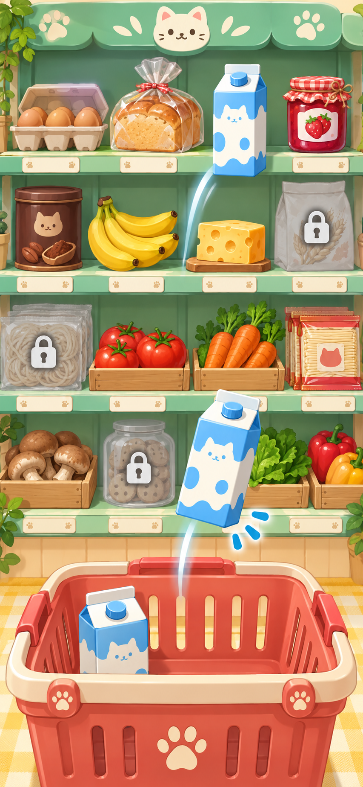

# 냥냥식당 v2 후속 개편 계획

상태: **0~5단계 구현 완료, 새 QA 결과는 [후속 개편 QA 보고서](V2_FOLLOWUP_QA_REPORT.md)에 기록** (2026-09-27). 이 문서는 v2 구현 후 실제 화면을 보고 사용자가 추가로 확정한 피드백의 기준 문서다. 기존 기능의 구현·검증 기록은 [v2 QA 보고서](V2_QA_REPORT.md), 이전 요구사항은 [NEXT_REVISION_NOTES.md](NEXT_REVISION_NOTES.md)에 있다.

## 목표와 유지할 기준

- 7~11세가 시간 제한 없이 즐기는 냥냥식당의 기본 흐름(주문 → 장보기 → 조리 → 플레이팅 → 서빙)을 유지한다.
- 식당 배경의 따뜻한 디자인과 색감은 살리면서 인물·조리대의 위치 관계를 다시 만든다.
- 마트와 조리는 실제로 물건을 고르고 손으로 만드는 느낌이 들게 한다. 화면의 그림과 터치 판정이 같은 대상을 가리켜야 한다.
- 음식, 꾸미기 재료, 접시를 포함해 **게임에 보이는 모든 이미지와 모션을 전수 확인**한다. 단순 SVG·이모지·임시 그림이 캐릭터 및 배경 옆에서 이질적으로 보이는 곳은 교체하거나 다시 그린다.
- 이미 구현된 Lv.1~5, 14종 레시피, 시크릿 2종, 스페셜 손님, 가족별 보상, 100코인 미니게임, 꾸미기 구매·장착, SQLite 프로필 저장, 장소별 BGM은 회귀 대상으로 보존한다. 기존 DB와 브라우저 저장 기록을 검증 전에 초기화하지 않는다.

## 사용자와 확정한 화면·동작

| 영역 | 개편 방향 |
| --- | --- |
| 식당 구도 | 현재 배경의 분위기를 유지한다. 조리대를 화면 가까이 배치하고 주인공 셰프는 **조리대 뒤에서 손님을 맞이**한다. 손님은 조리대 앞쪽에 서거나 다가온다. 셰프의 손·접시·음식은 조리대 위에서 보이고, 조리대 앞면은 셰프의 하체를 자연스럽게 가린다. 기존·구매 배경 모두 같은 카메라 높이와 인물 기준점을 쓴다. |
| 가족 고양이 | 엄마·아빠·동생을 주인공의 크기만 바꾼 모습으로 두지 않는다. 털 색과 무늬, 얼굴형, 귀·눈, 체형, 옷, 자세로 구분한다. 엄마·아빠가 모두 갈색일 필요는 없다. 제작 기본안은 엄마 크림/삼색, 아빠 회청색, 동생 다른 무늬와 더 작은 실루엣이다. 기본·기쁨·식사 반응에서도 동일 인물로 알아볼 수 있어야 한다. |
| 마트 진입 | 처음 들어가면 **곰 주인아저씨가 계산대 뒤에서 인사**한다. 계산대 오른쪽에 실제 마트처럼 보이는 정면 진열대가 이어진다. 계산대·진열대는 하나의 가로 공간이며, 상품 구간은 페이지 단위 전환이나 강제 스냅 없이 **연속 가로 스크롤**한다. |
| 마트 구매 | 화면 아래 열린 장바구니는 쇼핑 중 고정한다. 진열대의 상품을 고르면 바구니에 담기는 시각 반응을 주고, 수량·합계를 확인한다. 계산을 누르면 주인아저씨의 계산대로 돌아와 구매를 확정한다. 계산 전에는 코인과 재고가 바뀌지 않는다. |
| 구매 불가 상품 | 구매할 수 없는 재료도 진열대에서 볼 수 있다. 흐린 색만 쓰지 않고 잠금 그림과 `Lv.n에 열려요` 또는 `코인이 부족해요` 같은 **이유 문구**를 붙인다. 눌러도 구매·장바구니 담기가 실행되지 않으며, 이유를 친근한 안내로 보여준다. |
| 조리 | 음식과 도구를 화면에서 직접 잡아 움직인다. 달걀은 팬 가장자리에 톡 치고, 재료는 수도꼭지 아래에서 씻고, 칼은 도마 위 재료를 자르고, 거품기는 반죽 안을 저으며, 잼은 빵에 펴 바르고, 뒤집개는 음식 아래로 들어간다. 보이지 않는 큰 조작 영역의 이동거리만으로 진행도를 채우지 않는다. |
| 조리 안내·난도 | 각 단계에 `무엇을 잡을지 → 어디로 움직일지 → 어떻게 바뀌는지`를 짧은 문장과 손 모양 시범으로 보여준다. 시간 제한·실패 벌점은 두지 않는다. 도움 기능은 동작 시범과 쉬운 판정을 제공하되 버튼 네 번으로 모든 조리를 건너뛰는 방식은 교체한다. 취소·재시도 시 재료는 중복 차감되지 않는다. |
| 이미지 품질 | 음식·식재료·플레이팅 토핑·접시·식기·도구·의상·모자·액세서리·배경·마트 진열품·보관 장소·미니게임 바구니와 낙하물·손님/가족 표정 및 모션을 모두 확인한다. 주인공·배경의 동화책풍 채색, 윤곽, 광원, 그림자와 어울리게 제작한다. |
| 미니게임 | 바구니·식재료·배경·획득 효과의 품질을 다른 화면과 맞춘다. 종료 **5초 전**부터 남은 시간과 테두리가 느리게 맥동하고 짧은 카운트다운 소리를 낸다. 빠른 번쩍임을 쓰지 않으며, 움직임 줄이기·음소거에서도 숫자와 문구로 종료를 알 수 있어야 한다. 참가비 100코인과 점수별 보상, 완료 시 최소 100코인 가치 지급은 유지한다. |

### 마트 구도 참고 시안

이 이미지는 **정면 진열대와 하단 고정 장바구니의 비율을 보여주는 참고 시안**이다. 최종 게임 화면은 아니다. 사용자 요청 이후 추가된 곰 주인아저씨·입구 계산대와 연속 스크롤은 이 그림에 없으므로 구현 때 별도 장면으로 합쳐야 한다. 상품명·가격·잠금 이유는 생성 이미지의 글자가 아니라 실제 UI 텍스트로 표시한다. 브랜드나 참고 이미지의 상품 포장은 복제하지 않는다.

## 개편 전 구현에서 확인한 문제와 출발점

- [현재 식당 화면](qa-v2/01-first-play.png)은 배경 속 조리대가 멀리 있고 `.character-pair`가 셰프와 손님을 앞쪽 바닥에 나란히 배치한다. 배경만 확대하는 것으로 해결하지 말고, 조리대 앞면·셰프·접시·손님의 가림 관계를 별도 층으로 구성한다.
- `public/game/family-*.png`는 옷과 크기는 다르지만 모두 주황 털과 유사한 얼굴이다. 작은 화면의 [가족 선택/식사](qa-v2/05-family-eating.png)에서 색·형태 차이를 키워야 한다.
- `src/v2/AppV2.tsx`의 마트는 현재 상품 카드 띠와 장바구니 요약이다. 주인아저씨가 있는 입구 및 실제 진열대 공간이 필요하다.
- `Kitchen.updateGesture`는 조리 영역 어디서든 방향별 이동량으로 진행도를 더한다. `CookScene`은 진행도에 따라 그림을 바꾸지만 화면의 도구 손잡이와 포인터가 결합되어 있지 않다. `조리가 어려우면 도움받기 +25%`도 네 번 누르면 단계를 끝낸다.
- 음식·재료·꾸미기는 각각 `FoodArt.tsx`, `IngredientVisual.tsx`, `GearArt.tsx`의 단순 SVG 또는 목록 이모지를 사용한다. 인물·배경은 채색된 비트맵이어서 [현재 마트](qa-v2/02-mart.png), [꾸미기](qa-v2/03-wardrobe.png), [조리](qa-v2/07-cooking-gesture.png)에서 질감 차이가 보인다.
- 미니게임의 바구니는 현재 이모지이고 남은 시간은 숫자로만 나타난다. 시각적 경고와 화면 전체 아트 점검이 필요하다.

## 전수 이미지 조사 기준

먼저 `public/game/`의 비트맵, 코드의 SVG·이모지, CSS 배경·장식, 각 모션 프레임과 표시 크기를 **화면별·상태별 자산 표**로 만든다. 기준은 `좋아 보이는 개별 그림`보다 실제 장면 안에서의 일관성이다.

| 묶음 | 확인할 상태 |
| --- | --- |
| 공간·소품 | 기본/구매 식당 배경, 앞쪽 조리대와 계산대, 마트 진열대·선반, 주방 냉장고·선반·상온 보관장, 플레이팅 접시·식기, 미니게임 배경·바구니 |
| 인물 | 셰프 기본/의상/모자/액세서리, 엄마·아빠·동생, 일반·스페셜 손님, 곰 마트 주인아저씨의 기본·인사·받기·먹기·기쁨 프레임 |
| 음식·재료 | 기존 14종 요리, 18종 재료, 시크릿·토핑 조합, 마트 상품 모습, 손질 전/중/후, 완성 접시와 손님에게 전달되는 모습 |
| UI 장식 | 꾸미기 상품 이미지와 실제 착용 결과, 도감·퀘스트·보상·미니게임에서 보이는 모든 아이콘 및 배지, 잠금·재고 0개·부족 코인 상태 |

각 항목을 투명 가장자리, 동일한 빛 방향, 시점·비율, 모바일 축소 시 식별성, 그림자, 모션 연결, 용량·로드 실패까지 확인한다. 그림을 새로 만들 때 원본/생성 지시와 최종 파일의 대응표를 남긴다. 의상과 장식은 목록 이미지와 셰프에게 장착한 결과가 같은 디자인이어야 한다. 배경·가구·캐릭터의 접지 그림자와 가림 관계를 실제 화면에서 확인한다.

## 실행 순서와 단계별 통과 조건

| 단계 | 작업 | 다음 단계 조건 |
| --- | --- | --- |
| 0. 보존·전수 조사 | 현재 Git 상태와 기준 테스트 확인, 사용 중인 SQLite 백업, 기존 브라우저 기록 보존. 모든 화면·상태의 자산 표와 공통 아트 기준, 식당·마트·주방 구성 시안을 만든다. | 기존 데이터가 보존되고 이미지 누락·이질감 목록과 교체 우선순위가 확정됨 |
| 1. 식당·가족 장면 | 가까운 조리대와 인물 레이어, 셰프의 뒤쪽 위치, 손님 접근·서빙 위치를 만든다. 가족 3명을 다른 털색·실루엣·얼굴·옷으로 제작하고 반응 프레임을 연결한다. | 320/390/430px에서 주인공이 조리대 뒤에 있고 가족을 이름 없이 구별할 수 있음 |
| 2. 마트 공간 | 곰 주인아저씨의 계산대 입구, 오른쪽으로 이어지는 실물형 진열대, 연속 가로 스크롤, 고정 장바구니, 잠금·부족 코인 상태, 계산대 복귀를 구현한다. | 터치·마우스로 스크롤, 담기·취소·수량·계산이 되고 불가 상품이 보이며 이유가 읽힘 |
| 3. 조리 상호작용 | 대표 흐름 1개를 재료 집기 → 실제 도구 조작 → 변화 → 플레이팅 → 서빙까지 완성한다. 달걀 깨기, 씻기, 자르기, 젓기, 바르기, 붓기, 굽기, 뒤집기, 뿌리기, 쌓기의 재사용 가능한 직접 조작을 전체 레시피에 적용한다. | 도구/재료 밖의 임의 문지르기로 완료되지 않고, 모든 단계가 설명 없이도 시각적으로 이해됨. 취소·재시도·재료 부족이 안전함 |
| 4. 전체 아트·연출 | 모든 음식 상태·접시·토핑·소품·꾸미기와 미니게임 아트를 공통 기준으로 교체한다. 받기·먹기·반응 모션과 조리 효과음, 마지막 5초 경고를 다듬는다. | 전수 자산 표의 모든 항목이 실제 장면에서 확인되고 깨진 이미지·어색한 가림·임시 이모지가 없음 |
| 5. 통합 QA·인계 | 모든 레시피와 기존 v2 기능 회귀, 모바일 브라우저 E2E, 이미지 디코딩·스크린샷 비교, 테스트·lint·build를 실행하고 실패를 수정한다. 새 화면 증거와 QA 보고서를 남긴다. | 진행 불가·중복 차감/보상·데이터 손실이 없고 자동 검증 통과. 어린이 재미 평가와 물리 기기 점검은 수행 여부를 별도로 표시 |

## 꼭 다시 검증할 시나리오

1. 첫 방문 식당 구도, 기본·구매 배경에서 셰프/조리대/손님 배치, 주문·스페셜 손님·손님 식사 장면.
2. 엄마·아빠·동생 선택, 서로 다른 모습/식사 반응/선호 보상, 오주문 가족 대접 후 원래 주문 유지.
3. 마트 진입 인사 → 오른쪽 진열대 연속 스크롤 → 잠김/코인 부족 상품 확인 → 장바구니 담기·빼기 → 곰 아저씨 계산대 구매, 부족 코인·중복 요청·새로고침.
4. 14종 모든 레시피의 해당 조리 동작, 직접 도구 조작과 변화, 도움 시범, 재료 0개, 조리 취소·다시 시도·완성 후 한 번만 차감.
5. 플레이팅의 접시/토핑/음식 합성, 꾸미기 상품과 실제 착용 일치, 구매·장착·재시작 복원.
6. 미니게임 바구니 터치 이동, 종료 5초 경고·음소거·움직임 줄이기, 점수별 보상과 참가비 100코인, 최저 보상 가치 100코인 이상.
7. 두 프로필 분리, SQLite 저장·서버 재시작 복원, v1 브라우저 기록 이전, 보상 중복 방지, 식당/마트 BGM 전환과 효과음.
8. 320×568, 390×844, 430×932의 터치·스크롤·가로 넘침·글자/그림 잘림. 실제 어린이의 재미 평가와 물리 휴대전화 청취/조작 평가는 수행 전까지 `미확인`으로 적는다.

## 범위 해석

이 문서는 후속 개편의 요구사항 원문이다. 구현 결과와 새 화면 증거는 [후속 개편 QA 보고서](V2_FOLLOWUP_QA_REPORT.md), 자산별 조사는 [후속 아트 조사](V2_FOLLOWUP_ART_AUDIT.md)에 기록한다. 이전 [v2 QA 보고서](V2_QA_REPORT.md)의 통과 결과를 새 화면의 증거로 재사용하지 않는다.
